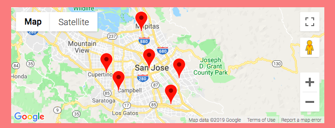

<h1 align='center'>Restaurant Roulette</h1>

Live Demo: https://duyhtruong.github.io/restaurant-roulette

 
 

		 
Everyone has had this conversation. After being asked 'Where do you want to eat?', my brain momentarily
				shuts down, not knowing how to respond, followed by endless scrolling on Yelp.
  
  
  Today, people have the luxury of choice. 
				Whether it be the type of car they choose to drive, or what brand canned-corn they want
				 to buy for Thanksgiving dinner, the options are endless. The result is a 'first-world-problem' of being 
				 paralyzed by choice, or not being able to easily make a decision. 
				 With around 5,000 restaurants listed on Yelp in San Francisco, choosing a place to 
				 eat is no easy feat.  
         
Restaurant Roulette was created in the hopes of removing one less question out of a user's day.
				The web app takes in user criteria, such as price point and distance from user, and returns a randomized
				list of nearby restaurants. 

					The web app fetches restaurant data from Google Places API and displays 
					the location of the resulting restaurants using Google Maps.

<strong>To Use: </strong>
					<ul>
						<li>Allow Location Services on your device</li>
						<li>Toggle between different search parameters</li>
						<li>Click Go to get a list of randomized restaurants</li>
					</ul>
